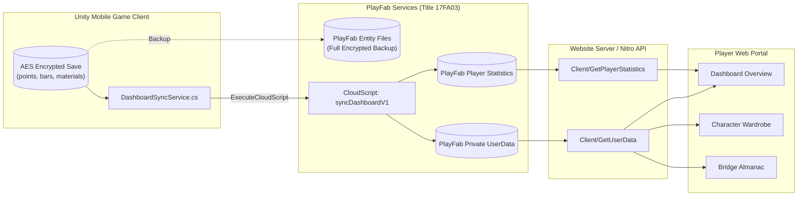

# CivilCraft: Data Flow Architecture & Synchronization
**Thesis Technical Specification: Cloud Storage, Game Projections, and Web Dashboards**

---

## 1. Overview of Data Flow Architecture

The CivilCraft ecosystem implements a segmented data architecture designed to balance gameplay performance, cross-platform persistence, network bandwidth, and web security.

Information travels across three core application environments:
1. **The Native Mobile Client (Unity Android)**: The authoritative environment for physical simulation, 2D drafting coordinates, bridge topological structures, and save encryption.
2. **Microsoft Azure PlayFab Backend (Title 17FA03)**: The central cloud service acting as the authoritative identity provider, virtual currency ledger, and primary storage engine.
3. **The Web Application (TanStack Start / React)**: A lightweight, read-only consumer for player dashboards, leaderboards, educational almanacs, and administrative management.



---

## 2. Cloud Storage Segmentation & Purpose

To prevent security vulnerabilities and minimize payload transfer over mobile networks, the data stores in PlayFab are strictly segregated:

### 2.1 PlayFab Entity Files (`CloudSaveManager.cs`)
* **Scope**: Exclusive to the Unity Android Game Client.
* **Payload**: Encrypted binary payload (`default.dat`) containing complete bridge node geometry (`points`), structural member connections (`bars`), materials, local settings, and internal game state flags.
* **Encryption**: AES-encrypted on device using `SaveEncryption.cs` prior to upload.
* **Security Rule**: **Never requested, downloaded, or processed by the website**. The web portal does not possess the decryption keys or the geometric rendering pipeline for raw bridge meshes.

### 2.2 PlayFab Private UserData (`syncDashboardV1`)
* **Scope**: Written exclusively by CloudScript; read by the authenticated player via `Client/GetUserData`.
* **Payload**: 11 sanitized string and serialized JSON keys representing high-level player metrics, character wardrobe selections, and almanac milestones.
* **Access Control**: Configured with private user permissions (`Permission: "Private"`), ensuring a player cannot read another player's private UserData.

### 2.3 PlayFab Player Statistics
* **Scope**: Written by CloudScript; queryable via `Client/GetPlayerStatistics` and `Client/GetLeaderboard`.
* **Payload**: Integer values representing career scores and ranking metrics (`TotalScore`, `BridgesCompleted`, `ChallengesCompleted`, `BestSingleBuildScore`).
* **Purpose**: Feeds both the personal player dashboard and the global public leaderboard tables.

### 2.4 Website Presentation CMS / Static Assets
* **Scope**: Managed by the web application and Vercel Blob Storage.
* **Payload**: Educational bridge engineering literature, ASCII force diagrams, material characteristics, game releases (APKs), and curated media gallery items.
* **Purpose**: Serves public visitors and enriches raw PlayFab player milestones with rich educational context.

---

## 3. The 15 Synchronized Fields (`syncDashboardV1`)

Published CloudScript **Revision 5** (`handlers.syncDashboardV1`) on Title ID `17FA03` defines the exact contract between Unity and the PlayFab backend. All 15 fields are required on every publication call.

| Field Name | Expected JSON Type & Validation | Destination in PlayFab | Semantic Description |
| :--- | :--- | :--- | :--- |
| `schemaVersion` | Integer number, exactly `1` | Validated; returned | Contract version identifier. |
| `currentLevel` | Integer, 1–1,000 inclusive | UserData: `CurrentLevel` | Player's engineering level. |
| `xp` | Integer, 0–2,147,483,647 inclusive | UserData: `XP` | Current accumulated experience points. |
| `xpToNextLevel` | Integer, 1–2,147,483,647 inclusive | UserData: `XPToNextLevel` | Threshold required to advance to next level. |
| `currentRegion` | String, max 100 characters | UserData: `CurrentRegion` | Identifier of active story region. |
| `achievementsUnlocked` | Integer, 0–10,000; <= `achievementsTotal` | UserData: `AchievementsUnlocked` | Count of achievements completed. |
| `achievementsTotal` | Integer, 0–10,000 inclusive | UserData: `AchievementsTotal` | Total achievements in game catalog. |
| `totalScore` | Integer, 0–2,147,483,647 inclusive | Statistic: `TotalScore` | Career cumulative engineering score. |
| `bridgesCompleted` | Integer, 0–2,147,483,647 inclusive | UserData & Stat: `BridgesCompleted` | Total contracts successfully completed. |
| `challengesCompleted`| Integer, 0–2,147,483,647 inclusive | UserData & Stat: `ChallengesCompleted` | Total optional challenge contracts solved. |
| `bestSingleBuildScore`| Integer, 0–2,147,483,647 inclusive | Statistic: `BestSingleBuildScore` | Highest individual score achieved on a single build. |
| `mapProgress` | Valid JSON Object string, <= 10,000 chars | UserData: `MapProgress` | Serialized progress per region and contract. |
| `achievementProgress`| Valid JSON Array string, <= 10,000 chars | UserData: `AchievementProgress` | Array of unlocked achievement IDs with timestamps. |
| `equippedCosmetics` | Valid JSON Object string, <= 10,000 chars | UserData: `EquippedCosmetics` | Wardrobe loadout DTO (hair, top, pants, shoes, accessories). |
| `almanacProgress` | Valid JSON Object string, <= 10,000 chars | UserData: `AlmanacProgress` | Discovered materials, bridge types, and level records. |

*Note: The CloudScript handler automatically computes and stamps `CharacterSyncedAt` as an ISO-8601 UTC timestamp upon successful execution.*

---

## 4. Wardrobe & Equipment Resolution Model

In the Unity mobile client (`Assets/Script/Player/PlayerSave/CosmeticDefinition.cs`), equipment is modeled via `CosmeticLoadoutData` and stored in `PlayerData.cs`:

```json
{
  "hairID": "Hair_1",
  "shirtID": "Shirt_Tee1",
  "pantsID": "Pants_Cargo",
  "shoesID": "Shoes_Boots1",
  "accessoryIDs": ["EngineeringHardHat", "Accessory_SafetyVest"],
  "accessoriesID": "EngineeringHardHat"
}
```

### Web Ingestion Rules:
1. **Multi-Accessory Support**: The website parser (`src/lib/playfab/equipment.ts`) recognizes both `accessoryIDs` (array) and `accessoriesID` (legacy string fallback). When an array is provided, distinct cards are rendered for every equipped accessory (e.g., both Hard Hat and Safety Vest) without overwriting.
2. **Sentinel Handling**: The identifier `Accessory_None` (case-insensitive) is recognized as the empty accessory sentinel.
3. **Item Resolution**: The website matches published item IDs against the PlayFab Catalog (`Client/GetCatalogItems`) and static website item dictionaries (`cosmetics-catalog.ts`). Unknown IDs are preserved and displayed as clean identifiers rather than broken images.

---

## 5. Security & Credential Isolation

To comply with enterprise security principles and academic defense scrutiny, the CivilCraft system maintains strict credential isolation:

1. **PlayFab Title ID (`17FA03`)**:
   * Stored in public frontend environment variables (`VITE_PLAYFAB_TITLE_ID`).
   * Designed to be public; safe for browser and mobile client inclusion.
2. **PlayFab Developer Secret Key (`PLAYFAB_SECRET_KEY`)**:
   * Kept strictly on the backend server (`admin-api.server.ts`, `fulfillment.server.ts`).
   * **Never exposed to client bundles, browser cookies, or Unity APKs**.
   * Used exclusively for privileged operations: player unbanning, ban moderation, directory search pagination, and virtual coin crediting.
3. **PayMongo Secret Keys (`PAYMONGO_SECRET_KEY`, `PAYMONGO_WEBHOOK_SECRET`)**:
   * Kept strictly in server environment variables.
   * Webhook requests verify cryptographic HMAC signatures to prevent spoofed coin fulfillment.
