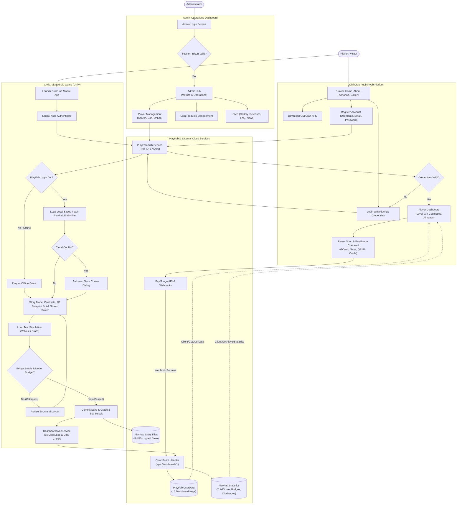
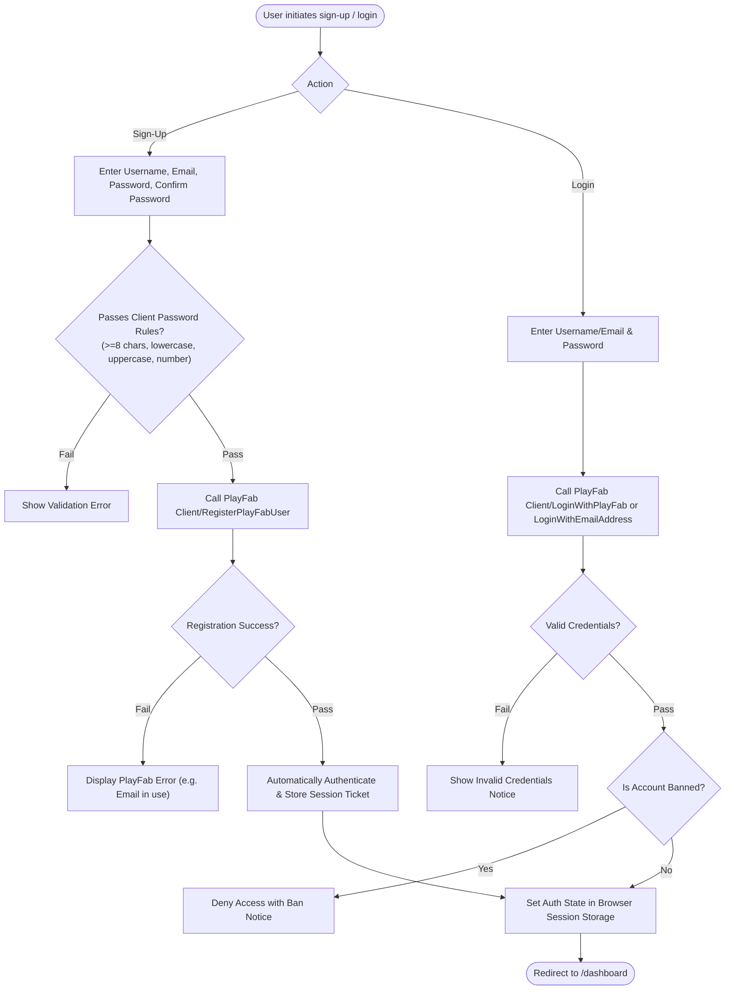
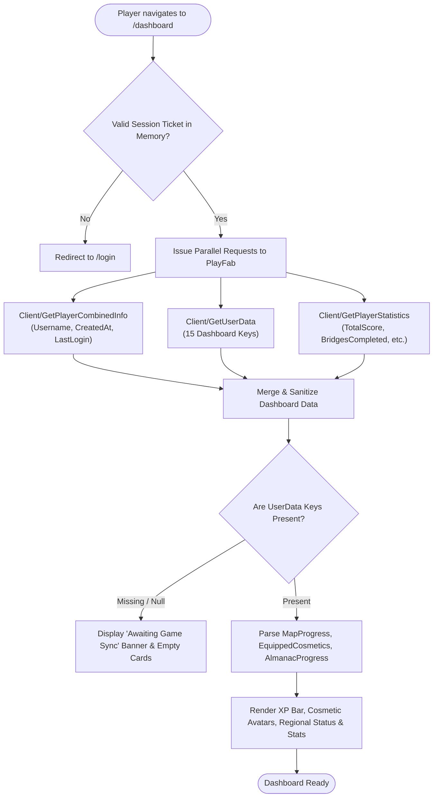
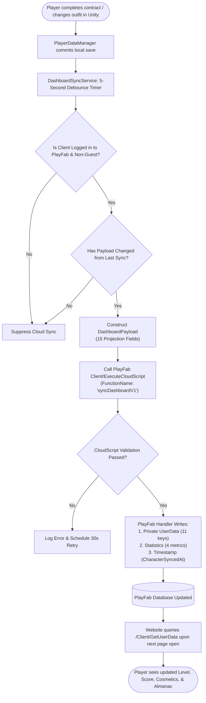
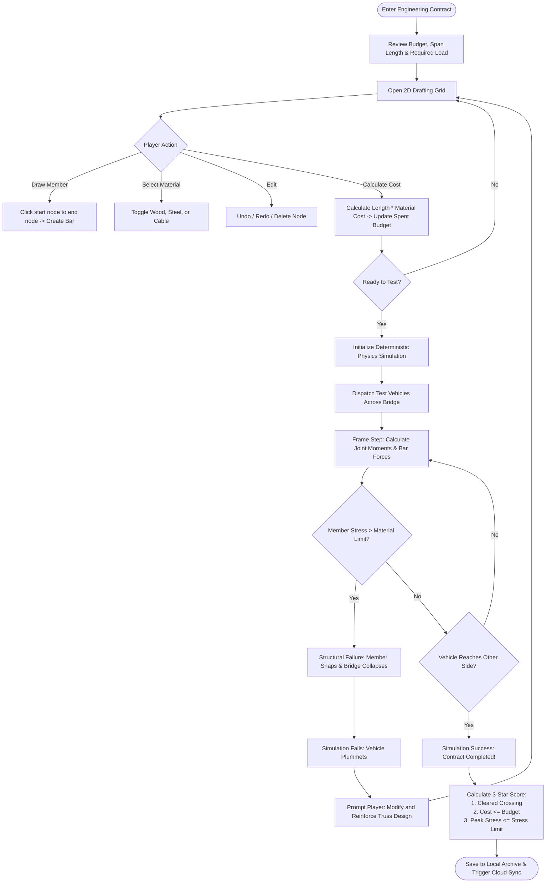
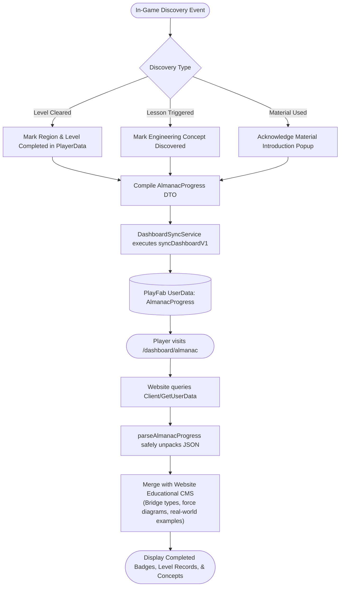
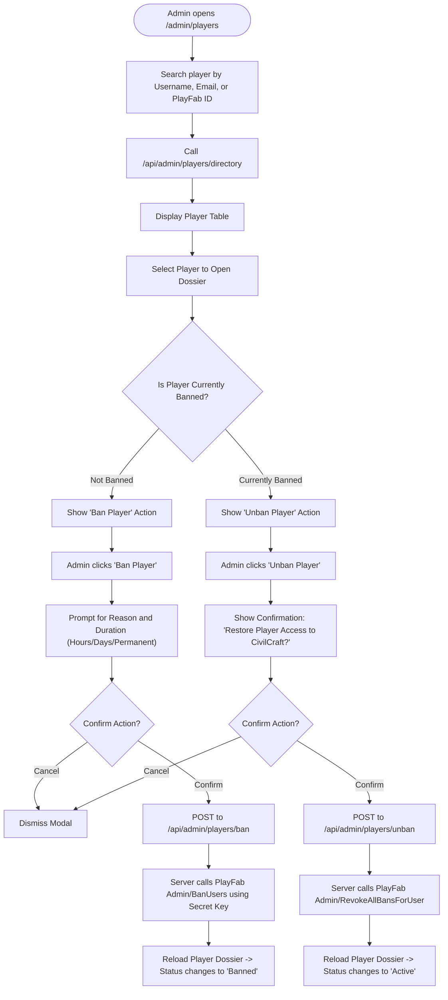
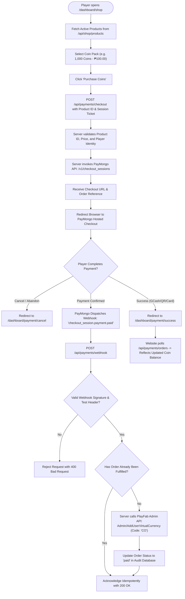
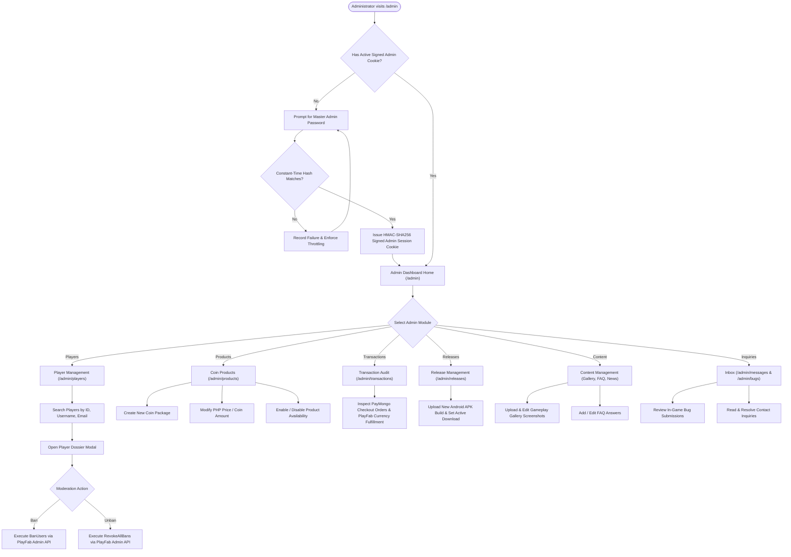

# CivilCraft: System Flowcharts & Architectural Diagrams
**Thesis System Architecture & Process Workflows**

---

## 1. High-Level System Architecture Flowchart

The following diagram illustrates the overarching architecture of CivilCraft: Bridge Edition, showing the interaction between the player, the public website, the Unity mobile client, PlayFab cloud services, the administrative portal, and external integrations (PayMongo).

---

## 2. Detailed Process Flowcharts

### 2.1 Registration & Authentication Flow

### 2.2 Player Dashboard Data Retrieval Flow

### 2.3 Game → PlayFab → Website Synchronization Flow

### 2.4 Bridge Construction & Load-Testing Gameplay Flow

### 2.5 Bridge Almanac Discovery & Progression Flow

### 2.6 Admin Player Moderation Flow (Ban / Unban)

### 2.7 Payment, Coin Purchase & Fulfillment Flow (PayMongo)

### 2.8 Administrative Control & Management Flow

