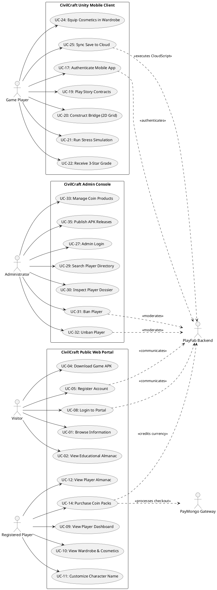

# CivilCraft: Use Case Specifications & Actor Inventory
**Thesis System Requirements & Functional Specifications**

---

## 1. System Actors

The CivilCraft ecosystem is operated and serviced by six distinct actors:

1. **Visitor (Unauthenticated Web User)**: Any individual visiting the public web application to browse bridge engineering literature, review media galleries, learn about development, or download the game client.
2. **Registered Player**: An authenticated web user who possesses an active Microsoft Azure PlayFab account and interacts with the web portal to review career statistics, customize character metadata, and purchase virtual currency.
3. **CivilCraft Game Player**: A user interacting with the native 3D Unity mobile simulation on an Android device to build bridges, run structural simulations, and progress through contracts.
4. **Administrator**: A privileged operator accessing the back-office management console to moderate accounts, update digital storefront goods, manage software releases, and configure content.
5. **PlayFab Backend (External Actor / Cloud Service)**: Microsoft Azure PlayFab service suite that provides player identity management, private UserData storage, leaderboard statistics, virtual currency ledgers, and CloudScript execution.
6. **PayMongo Gateway (External Actor / Financial Service)**: Philippine payment processing gateway facilitating transactions across domestic e-wallets (GCash, Maya), QR Ph, and card networks.

---

## 2. Use Case Inventory

### 2.1 Actor: Visitor
* **UC-01: Browse Public Information**: View landing page, project background, learning philosophy, and team profiles.
* **UC-02: View Public Bridge Almanac**: Read engineering documentation covering Beam, Truss, Arch, and Suspension bridges with ASCII force diagrams.
* **UC-03: View Media Gallery**: Browse categorized in-game screenshots and simulation captures.
* **UC-04: Download Game APK**: Access and download the latest validated Android installer build.
* **UC-05: Register Account**: Create a unified PlayFab account using email, username, and password.
* **UC-06: Submit Contact Inquiry**: Send structured inquiries or feedback via the web contact form.
* **UC-07: Request Password Recovery**: Initiate an automated password recovery link dispatch.

### 2.2 Actor: Registered Player
* **UC-08: Portal Login**: Authenticate using username/email and password to establish a web session.
* **UC-09: View Player Dashboard**: Inspect current level, XP progress, completion metrics, and high scores.
* **UC-10: View Character Wardrobe**: Inspect equipped hair, tops, pants, shoes, and multiple accessories.
* **UC-11: Customize Character Name**: Modify player persona name independently of login username.
* **UC-12: View Player Almanac Journey**: Inspect synchronized bridge completion badges and discovered materials.
* **UC-13: View Leaderboards**: Compare career scores and contract efficiency across global ranks.
* **UC-14: Purchase Coin Packs**: Purchase in-game coins (`CO`) via PayMongo hosted checkout.
* **UC-15: View Order History**: Review personal coin transaction receipts and fulfillment statuses.
* **UC-16: Portal Logout**: Terminate web session and wipe browser authentication state.

### 2.3 Actor: CivilCraft Game Player
* **UC-17: Authenticate Mobile App**: Sign in to the Unity mobile client using shared PlayFab credentials (or choose offline guest).
* **UC-18: Resolve Cloud Save Conflicts**: Reconcile conflicts between local device saves and cloud backups.
* **UC-19: Play Story Mode Contracts**: Accept engineering contracts and dialogues with mentor Professor Bhan.
* **UC-20: Construct Bridge (2D Blueprint)**: Place nodes and structural beams across spans in drafting view.
* **UC-21: Execute Stress Simulation**: Run deterministic structural mechanics simulations under vehicle loads.
* **UC-22: Receive 3-Star Grade**: Receive automated grading for clearance, budgetary efficiency, and peak stress.
* **UC-23: Discover Engineering Lessons**: Unlock educational mechanics entries during story playthrough.
* **UC-24: Equip Cosmetics**: Customize character appearance in mobile wardrobe.
* **UC-25: Sync Save to Cloud**: Automatically push 15 unencrypted career metrics to PlayFab via CloudScript.
* **UC-26: Host / Join Multiplayer Session**: Connect to 2-player co-op room via room codes *(In-Development in Game)*.

### 2.4 Actor: Administrator
* **UC-27: Admin Login**: Authenticate to administrative console using master credential and secure cookie generation.
* **UC-28: View System Overview**: Monitor platform metrics including player counts, bans, and transaction volume.
* **UC-29: Search Player Directory**: Query registered players by PlayFab ID, username, or email.
* **UC-30: Inspect Player Dossier**: Review detailed player progression, login history, and moderation logs.
* **UC-31: Ban Player**: Suspend an account across game and web using PlayFab Admin API.
* **UC-32: Unban Player**: Revoke active bans and restore full player access.
* **UC-33: Manage Coin Products**: Add, edit, or disable virtual coin packages in the player shop.
* **UC-34: Review Transactions**: Audit payment gateway orders and corresponding virtual currency fulfillment.
* **UC-35: Publish APK Releases**: Upload new Android game packages and configure active public download targets.
* **UC-36: Manage Gallery CMS**: Upload, caption, order, or remove public gameplay screenshots.
* **UC-37: Manage FAQ & News**: Publish and edit public informational articles and answers.
* **UC-38: Review Inquiries & Bugs**: Review bug reports and contact messages submitted by users.

---

## 3. PlantUML Use Case Diagram

---

## 4. Formal Use Case Specifications

### USE CASE ID: UC-05
* **USE CASE NAME**: Register Account
* **PRIMARY ACTOR**: Visitor
* **DESCRIPTION**: Enables a new player to establish a persistent game identity valid across both web portal and mobile simulation.
* **PRECONDITIONS**: Visitor possesses internet connectivity and has not authenticated.
* **TRIGGER**: Visitor clicks "Sign Up" or "Create Account".
* **MAIN FLOW**:
  1. System renders registration form with fields: Username, Email, Password, Confirm Password.
  2. Visitor inputs credentials and clicks submit.
  3. Client validates password complexity (>= 8 characters, requiring uppercase, lowercase, and digits).
  4. System calls PlayFab `Client/RegisterPlayFabUser` passing `TitleId: "17FA03"`.
  5. PlayFab creates player master entity and returns PlayFab ID and Session Ticket.
  6. Client saves session ticket to browser storage and redirects to `/dashboard`.
* **ALTERNATIVE FLOW**:
  * *Password mismatch*: Validation fails locally; client highlights confirmation field.
* **EXCEPTION FLOW**:
  * *Duplicate identity*: PlayFab returns error `UsernameNotAvailable` or `EmailAddressNotAvailable`. System alerts user and leaves form populated for correction.
* **POSTCONDITION**: Account exists in PlayFab Title; player can log into both Android client and website.

---

### USE CASE ID: UC-08
* **USE CASE NAME**: Portal Login
* **PRIMARY ACTOR**: Registered Player
* **DESCRIPTION**: Authenticates an existing player to establish an active web session.
* **PRECONDITIONS**: Player has a registered account.
* **TRIGGER**: Player accesses `/login` and submits credentials.
* **MAIN FLOW**:
  1. Player inputs Username or Email and Password.
  2. System detects input format (email regex vs username string).
  3. System calls `Client/LoginWithEmailAddress` or `Client/LoginWithPlayFab`.
  4. PlayFab verifies credentials and returns Session Ticket.
  5. System checks account status; verifies player is not banned.
  6. System persists session ticket in memory and session storage.
  7. System redirects player to `/dashboard`.
* **ALTERNATIVE FLOW**:
  * *Remember Me checked*: System caches non-sensitive username in local preferences.
* **EXCEPTION FLOW**:
  * *Banned Account*: PlayFab returns `AccountBanned`. System blocks access and displays ban details.
  * *Invalid Credentials*: System displays error notice without revealing whether email or password was incorrect.
* **POSTCONDITION**: Authenticated session established; player dashboard accessible.

---

### USE CASE ID: UC-09
* **USE CASE NAME**: View Player Dashboard
* **PRIMARY ACTOR**: Registered Player
* **DESCRIPTION**: Queries PlayFab to retrieve and present real-time player progression metrics.
* **PRECONDITIONS**: Player is authenticated.
* **TRIGGER**: Player navigates to `/dashboard`.
* **MAIN FLOW**:
  1. System reads authenticated session ticket.
  2. System issues parallel requests:
     * `Client/GetUserData` requesting 15 designated keys (`CurrentLevel`, `XP`, `EquippedCosmetics`, etc.).
     * `Client/GetPlayerStatistics` requesting `TotalScore`, `BridgesCompleted`, `ChallengesCompleted`, `BestSingleBuildScore`.
  3. System merges responses and checks if `CharacterSyncedAt` is present.
  4. System parses JSON fields (`MapProgress`, `EquippedCosmetics`, `AlmanacProgress`).
  5. System calculates level progress bar percentage.
  6. System displays level, XP, score cards, and character summary.
* **ALTERNATIVE FLOW**:
  * *No game sync yet*: If `CharacterSyncedAt` is missing, system displays "Awaiting game sync" indicator with clean empty states.
* **EXCEPTION FLOW**:
  * *Session Ticket Expired*: PlayFab returns 401. System wipes credentials and redirects to `/login`.
* **POSTCONDITION**: Player views synchronized progression data without exposing raw save files.

---

### USE CASE ID: UC-11
* **USE CASE NAME**: Customize Character Name
* **PRIMARY ACTOR**: Registered Player
* **DESCRIPTION**: Allows player to set a custom in-game persona name distinct from their login username.
* **PRECONDITIONS**: Player is logged in and viewing `/dashboard/profile`.
* **TRIGGER**: Player edits Character Name field and clicks "Save Character Name".
* **MAIN FLOW**:
  1. Player enters desired character name string.
  2. System validates length (3 to 30 characters) and strips harmful control characters.
  3. System calls PlayFab `Client/UpdateUserData` with key `CharacterName`.
  4. PlayFab updates private user data.
  5. System displays success alert and updates dashboard header persona.
* **ALTERNATIVE FLOW**:
  * *Empty Input*: System defaults to existing account username.
* **EXCEPTION FLOW**:
  * *PlayFab Failure*: System displays error notice and keeps existing name intact.
* **POSTCONDITION**: `CharacterName` is saved in PlayFab UserData; reflected on profile and dashboard.

---

### USE CASE ID: UC-14
* **USE CASE NAME**: Purchase Coin Packs via PayMongo
* **PRIMARY ACTOR**: Registered Player
* **DESCRIPTION**: Facilitates the purchase of in-game coins (`CO`) using domestic payment options.
* **PRECONDITIONS**: Player is logged in and viewing `/dashboard/shop`.
* **TRIGGER**: Player selects a coin package and clicks "Purchase".
* **MAIN FLOW**:
  1. System displays active coin products retrieved from `/api/shop/products`.
  2. Player selects package (e.g. 1,000 Coins).
  3. System posts checkout request to `/api/payments/checkout`.
  4. Server validates product pricing and creates order in database.
  5. Server calls PayMongo API `/v1/checkout_sessions` requesting payment types (`gcash`, `paymaya`, `qrph`, `card`).
  6. PayMongo returns checkout URL.
  7. Client redirects browser to PayMongo hosted payment portal.
  8. Player completes payment.
  9. PayMongo dispatches webhook `checkout_session.payment.paid` to `/api/payments/webhook`.
  10. Server verifies webhook HMAC signature.
  11. Server calls PlayFab Admin API `AddUserVirtualCurrency` crediting virtual currency `CO`.
  12. Browser returns to `/dashboard/payment/success` and displays updated balance.
* **ALTERNATIVE FLOW**:
  * *Payment Cancelled*: Player cancels on PayMongo; browser redirects to `/dashboard/payment/cancel`.
* **EXCEPTION FLOW**:
  * *Duplicate Webhook*: Server detects order already fulfilled; returns 200 OK idempotently without double-crediting.
* **POSTCONDITION**: Virtual currency `CO` credited to player in PlayFab; order audit record set to paid.

---

### USE CASE ID: UC-20 & UC-21
* **USE CASE NAME**: Construct and Load-Test Bridge
* **PRIMARY ACTOR**: CivilCraft Game Player
* **DESCRIPTION**: The player drafts a structural bridge design and runs vehicle simulations inside the mobile game.
* **PRECONDITIONS**: Unity game client is running; contract level is active.
* **TRIGGER**: Player activates 2D drafting grid.
* **MAIN FLOW**:
  1. System renders canyon span and fixed bedrock anchor points.
  2. Player connects nodes using structural members (`Bar.cs`) made of Wood, Steel, or Cable.
  3. System tallies material costs against budget constraint.
  4. Player clicks "Simulate / Test".
  5. System activates `BridgePhysicsManager` and `DeterministicBridgeStressSolver`.
  6. Test vehicle begins traversing bridge.
  7. System computes joint loads and member axial stresses per frame.
  8. Member visual shaders update color from green (safe) to red (high stress).
  9. Vehicle reaches destination without exceeding member failure thresholds.
  10. System evaluates 3-Star rating:
      * Star 1: Vehicle crossed safely.
      * Star 2: Project expenditure within budget target.
      * Star 3: Peak stress within tolerance limit.
  11. Local save commits new attempt and triggers `DashboardSyncService`.
* **ALTERNATIVE FLOW**:
  * *Structural Failure*: Stress exceeds limit; member snaps and bridge collapses. System stops simulation and prompts player to revise truss triangulation.
* **POSTCONDITION**: Bridge geometry and high scores are saved locally and queued for cloud sync.

---

### USE CASE ID: UC-25
* **USE CASE NAME**: Synchronize Game Save to Cloud
* **PRIMARY ACTOR**: CivilCraft Game Player / Background Service
* **DESCRIPTION**: Automatically projects local mobile career metrics to PlayFab UserData via CloudScript.
* **PRECONDITIONS**: Mobile player is authenticated with non-guest PlayFab account.
* **TRIGGER**: Local save commits after contract completion or wardrobe change.
* **MAIN FLOW**:
  1. `DashboardSyncService` catches `OnSaveCommitted` event.
  2. Service initiates 5-second debounce window.
  3. Service computes checksum of current projected payload.
  4. Checksum differs from last publication; service constructs 15-field DTO.
  5. Service calls PlayFab `Client/ExecuteCloudScript` executing `syncDashboardV1`.
  6. Handler on Live revision validates all 15 parameters.
  7. Handler atomically writes 11 UserData keys and 4 Statistics, and stamps server timestamp `CharacterSyncedAt`.
  8. CloudScript returns `{"accepted": true, "schemaVersion": 1}`.
* **ALTERNATIVE FLOW**:
  * *Unchanged State*: If payload checksum equals last published signature, sync is bypassed.
* **EXCEPTION FLOW**:
  * *Network Interruption*: CloudScript call fails; service retains dirty flag and retries in 30 seconds.
* **POSTCONDITION**: PlayFab cloud store reflects newest level, cosmetics, scores, and almanac records.

---

### USE CASE ID: UC-31 & UC-32
* **USE CASE NAME**: Ban / Unban Player
* **PRIMARY ACTOR**: Administrator
* **DESCRIPTION**: Modifies player account accessibility via server-side PlayFab Admin APIs.
* **PRECONDITIONS**: Administrator is authenticated to `/admin`.
* **TRIGGER**: Administrator opens Player Dossier modal.
* **MAIN FLOW (BAN)**:
  1. Admin inspects active player dossier.
  2. Admin clicks "Ban Player", enters Reason and Duration.
  3. Admin confirms; browser posts to `/api/admin/players/ban`.
  4. Server calls PlayFab `Admin/BanUsers` using `PLAYFAB_SECRET_KEY`.
  5. PlayFab revokes active session tickets and blocks future logins.
  6. Server returns success; UI displays "Banned" status badge.
* **MAIN FLOW (UNBAN)**:
  1. Admin inspects banned player dossier.
  2. Admin clicks "Unban Player".
  3. System prompts confirmation modal.
  4. Admin confirms; browser posts to `/api/admin/players/unban`.
  5. Server calls PlayFab `Admin/RevokeAllBansForUser`.
  6. PlayFab clears ban records.
  7. Server returns success; UI updates status badge to "Active".
* **POSTCONDITION**: Account status mutated authoritatively in PlayFab.
